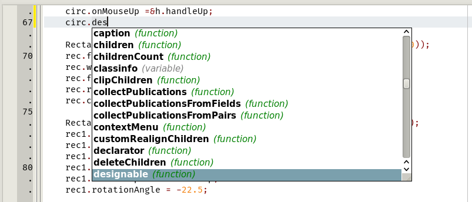
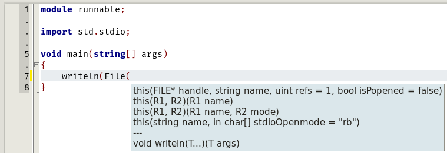
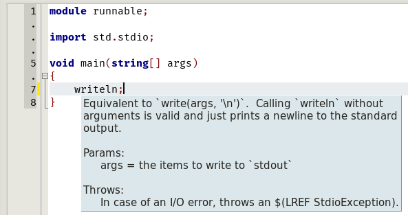
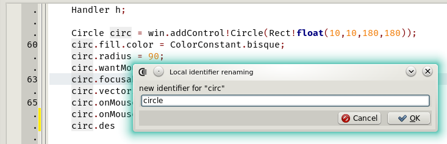





### D Completion Daemon

The D Completion Daemon (DCD) is used to accomplish IDE-grade features such as

- completion

- display function call tips

- display embedded documentation

- identifier renaming

- jump to declaration
- redirection to html documentation

#### Setup

_DCD_ is a third part software, it's bundled in the archives distributed for each new [release](https://github.com/Basile-z/dexed/releases).
However, _DCD_ may have to be build manually, for example if a new version is released while _Dexed_ development is paused for a while.
Visit the product [homepage](https://github.com/dlang-community/DCD) for more information.

Once DCD build or extracted from the release archive, copy the two programs (_dcd-client_ and _dcd-server_) to the folder where the Dexed executable stands.
They can be put elsewhere, as long as the target directory is a known operating system PATH.

#### Imports

In _Dexed_, _DCD_ relies on the [compilers paths](options_compilers_paths), on the [library manager](widgets_library_manager) entries and on the project parameters. When the [_libman_](widgets_library_manager) is empty then the scope of DCD is limited to the symbols of current module, of the current project sources and of the standard library, that's why it necessary to register the development libraries used in the _libman_.

_DCD_ also has its own configuration system. Refer to the official [Readme](https://github.com/dlang-community/DCD#configuration-files).

#### Initialization

When Dexed starts and if the DCD server is not already listening then it's launched by CE.
When Dexed stops, the server is only terminated if it was not already running when starting.

If the DCD server crashes while Dexed is running then both must be restarted.

#### Usage

- <kbd>CTRL</kbd> + <kbd>SPACE</kbd>: Calls the completion menu or completes automatically if possible. The default shortcut can be modified in the [shortcut editor](options_shortcuts_editor).
- <kbd>.</kbd> invokes the completion if the editor option _autoDotDelay_ is greater than 0.
- <kbd>CTRL</kbd> + <kbd>SHIFT</kbd> + <kbd>UP</kbd>: Jumps to the declaration of the symbol located at the cursor. The default shortcut can be modified.
- <kbd>CTRL</kbd> + <kbd>LEFT MOUSE BUTTON</kbd>: ditto.
- <kbd>(</kbd>: Gets the function call tips. When functions calls are nested, call tips are stacked and separated by a group of hyphen.
- <kbd>)</kbd>: If the call tips are displayed then decreases by one the stack of call tips.
- <kbd>ESC</kbd>: Closes the call tips window, whatever is the level of the stack.
- <kbd>CTRL</kbd> + <kbd>F2</kbd>: Renames the identifier for the symbol located at the cursor position. This works only if the symbol is declared in this module.
- <kbd>F1</kbd>: Displays the phobos documentation for the symbol that has the focus.

Documentation comments associated to a symbol are displayed when the cursor motion stops over a symbol.




