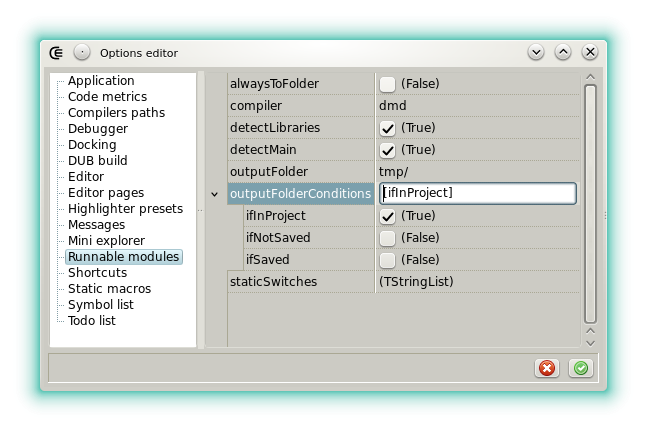


<script src="//cdnjs.cloudflare.com/ajax/libs/anchor-js/4.0.0/anchor.min.js"></script>


### Runnable modules

#### Description

Dexed is able to compile and execute the module that's currently edited even if it's not part of a project.
Such a module is called a **runnable** module.

Runnable modules don't have to be explicitly saved because Dexed will handle the task automatically, using an unique temporary file name.
For example it's possible to execute the _Compile and run file_ action directly after the _New runnable module_ action .
By default the binary is produced in the folder where is located the D source but this can be changed in the options applied to this feature.

A runnable is useful to quickly test an idea, learn how to use new libraries, or even to use modules as scripts, always without messing with the parameters that a project would require.

#### Shebang line

By default runnables don't need any setting however the shebang line can be used when specific compiler options are required.
Two typical scenarios:

- the runnable will be debugged so DWARF informations must be generated with `-g`.
- the runnable must be linked with a C static library so the linker flag `-L-lthelib` must be specified.

Dexed doesn't handle the program specified after the She-Bang, which means that all the following script lines are valid:

- `#!runnable-flags: --whatever`
- `#!usr/bin/dmd --whatever`
- `#!options --whatever`

In the three cases, every non white character after the She-Bang is ignored.
Options are detected after the first non white character of the script line.

#### Runnable I/O handling

In general the program output is redirected to the [messages](widgets_messages).
This is true unless the _Compile file and run outside_ or the _Run compiled file outside_ actions are used.
Note that in this case the [consoleProgram global options](options_application) allows to define the terminal used.

When the program is not run outside, the [process input widget](widgets_process_input) is used to pass input to the runnable.

#### Other

To be runnable, a module must verify:

- a `void main()` is present or the option to automatically detect the `main()` function is activated.
- the modules to import must be known, either by the [library manager](widgets_library_manager) or by the compiler configuration file.
- _import expressions_ ( `import(file);` ) are allowed if _file_ stands in the same folder as the module being edited.

The _Compile file and run outside_ action can be used to execute in an external console.
It must be used if the runnable outputs thousands of lines, to display properly UTF8 characters or if it has a GUI.

The version identifier **single_module** and **run_single_module** are automatically defined when a runnable is compiled.
It can be used to adjust the source according to the execution context, for example:

```d
version(single_module)
{
    stdout.writeln("to output stream");
}
else
{
    myFile.writeln("to a file");
}
```

When the action _Run file unittests_ is used, **single_module** and **test_single_module** are defined.

The executable produced is deleted after each run unless the file has been saved explicitly out of the initial temporary folder.
Note that the action _Run file unittest_ is based on the same internal function excepted that the `-main` and `-unittest` switches are automatically added to the switch list (menu **File**, action **Set runnable switches**).

#### Options



- **alwaysToFolder**: deprecated, checked meant **outputFolderCondition** set to [ifSaved, ifInProject], and [ifInProject] otherwise.
- **compiler**: Select the [compiler](options_compilers_paths) used to produce the runnable binary. When GDC or LDC is selected their bridges based on DMD command line interface are used (GDMD and LDMD). This setting is also used when a DUB script is compiled (see [Run DUB single file package](menu_file)).
- **detectLibraries**: When checked the static libraries used by the runnable are detected from the [library manager](widgets_library_manager) by performing import analysis. When unchecked, all the library manager entries are passed and the compiler does the selection.
- **detectMain**: When checked the `main()` function is detected automatically and the `-main` switch is set accordingly. When not checked `-main` is never passed. This options is useful with the **Run file unittests** action because it allows to test a module that's also a valid program.
- **outputFolder**: Defines a folder where the runnable binary is output. If the value starts by a drive letter or a directory separator then the folder must exist, otherwise it's considered as a subfolder, relative to the runnable filename, which is created automatically.
- **outputFolderConditions**: Defines the conditions for which **outputFolder** is handled.
    - **ifInProject**: The runnable file is part of the current project. For example if **temp/** is in the `.gitignore` and if **outputFolder** is also set to **temp/** then the binary won't appear in the staging area.
    - **ifSaved**: The runnable file is not in the current project but it's been saved explicitly out of the temp folder that's automatically used by Dexed.
    - **ifNotSaved**: The runnable file is not part of the project and has never been saved explicitly.
- **staticSwitches**: Defines a list of switches that are always passed to the compiler when a runnable is produced or when a module is tested.


<script>
anchors.add();
</script>

