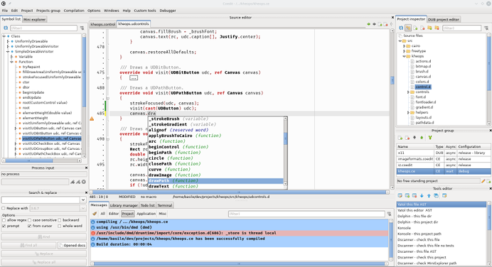





### Dexed documentation

This documentation is based on version 3.6.18.
Screenshots can be outdated but descriptions are up to date.

#### First steps

_Install and configure Dexed._

* [Build](build.md)
* [Setup](setup.md)

#### Tutos and guides

* [Usage in videos](videos.md)

#### Features

_General features or concepts that are not wrapped in a widget_

* [Completion deamon](features_dcd.md)
* [Projects](features_projects)
* [Runnable modules](features_runnables)
* [Symbolic strings](features_symbolic_strings)

#### Menu reference

_Description of each entry in the main menu. May redirect to a specific widget page._

* [File](menu_file)
* [Debugger](widgets_gdb_commander)
* [Project](features_projects)
* [Project groups](widgets_project_groups)

#### Options categories

_Full description of Dexed options. May redirect to a specific widget page._

* [Application](options_application)
* [Code metrics](options_code_metrics)
* [Compiler paths](options_compilers_paths)
* [Debugger](widgets_gdb_commander)
* [DUB build](options_dub_build)
* [Editor](widgets_editor)
* [Editor pages](options_editor_pages)
* [Messages](widgets_messages)
* [Mini explorer](widgets_mini_explorer)
* [Profile viewer](widgets_profile_viewer)
* [Runnable modules](features_runnables)
* [Shortcuts editor](options_shortcuts_editor)
* [Static macros](widgets_editor)
* [Symbol list](widgets_symbol_list)
* [Terminal](widgets_terminal)
* [Todo list](widgets_todo_list)

#### Widgets

_Description of each widget._

* [About box](widgets_about)
* [DFMT commander](widgets_dfmt_commander)
* [DEXED project editor](widgets_dexed_project_editor)
* [DUB project editor](widgets_dub_project_editor)
* [Custom tools](widgets_custom_tools)
* [Editor](widgets_editor)
* [GDB commander](widgets_gdb_commander)
* [Library manager](widgets_library_manager)
* [Mini explorer](widgets_mini_explorer)
* [Messages](widgets_messages)
* [Options editor](widgets_options_editor)
* [Profile viewer](widgets_profile_viewer)
* [Project groups](widgets_project_groups)
* [Project inspector](widgets_project_inspector)
* [Process input](widgets_process_input)
* [Search](widgets_search)
* [Symbol list](widgets_symbol_list)
* [Terminal](widgets_terminal)
* [Todo list](widgets_todo_list)




