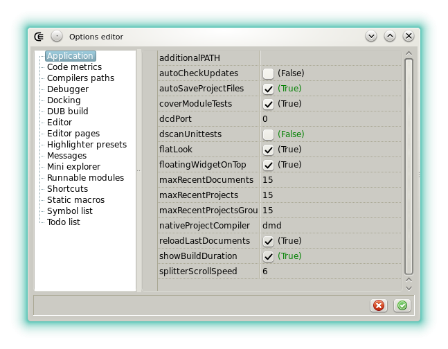





#### Application



The page exposes unsorted options. In the future some of them might be moved to their own category.

- **additionalPATH**: Used to defined more paths were the background tools can be found. Each item must be separated by a path separator (`:` under Linux and `;` under Windows).
- **autoCheckUpdates**: If checked and if a newer release is available then a dialog proposes to open the matching html page on github.
- **autoSaveProjectFiles**: If checked the sources are automatically saved before compilation.
- **consoleProgram**: Allows to set the terminal emulator used to execute programs. By default XTerm is used and an error can occur if it's not setup. The setting is used by the [runnable modules](features_runnables), the [custom tools](widgets_custom_tools) and the project launcher. Under Windows this option is not used.
- **coverModuleTests**: If checked then the coverage by the tests is measured and displayed in the messages after executing the action __File/Run file unittests__.
- **dcdPort**: Sets the port used by the [completion daemon](features_dcd) server. Under Windows `0` means the default value. Under GNU/Linux `0` means that a UNIX domain socket is used and any other number means that a TCP socket is used. This setting requires a restart.
- **dscanUnittests**: If checked the content of the `unittest` blocks are analyzed when using the action __File/Verify with Dscanner__. Do not activate if the results of the static analysis tend to generate irrelevant messages in the tests.
- **flatLook**: Doesn't draw the buttons shape unless they're hovered by the mouse.
- **floatingWidgetOnTop**: Keeps the widgets that are not docked on top of the application window.
- **maxReventDocuments**: Sets how many entries can be stored in __File/Open recent file__.
- **maxReventDocuments**: Sets how many entries can be stored in __Project/Open recent project__.
- **maxReventProjectsGroups**: Sets how many entries can be stored in __Projects group/Open recent group__.
- **nativeProjectCompiler**: Sets [which compiler](options_compilers_paths) is used to compile a project that has the [CE format](widgets_ce_project_editor).
- **reloadLastDocuments**: Sets if the sources, the project, and the group that were opened on exit are reloaded automatically.
- **showBuildDuration**: Sets if the duration of a project build is measured.
- **splitterScrollSpeed**: Sets how fast the splitters are moved when the scroll wheel is used.




