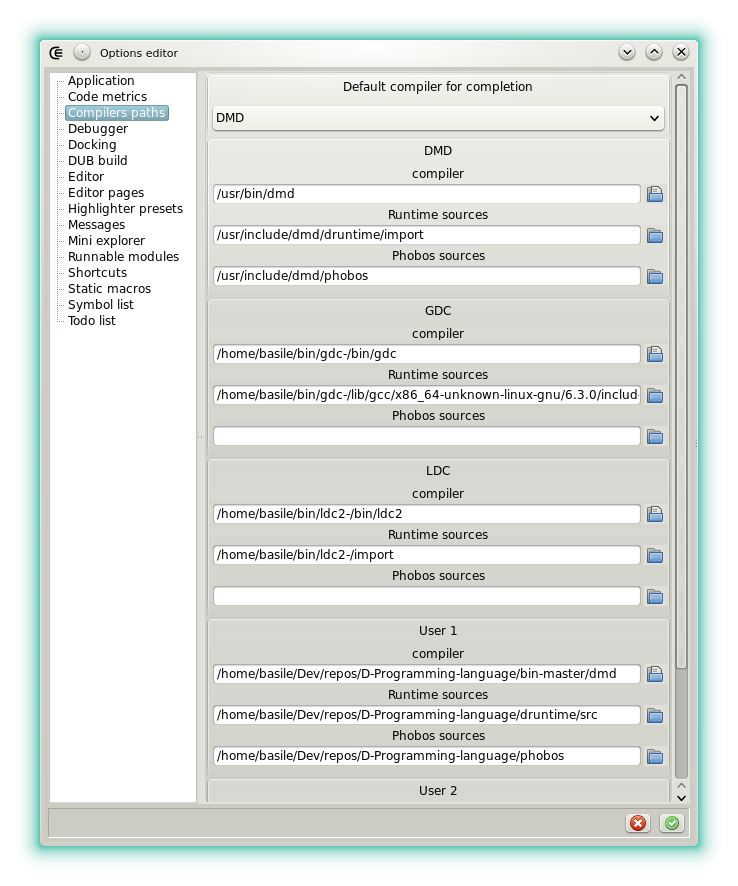





### Compilers paths

The _Compilers paths_ category is used to define the paths to the compilers and to their respective versions of the standard library.

These settings are important and should be verified after the installation.

Up to five D compilers can be defined.

* __DMD__: should be set to the stable DMD version. The paths are normally detected when _Dexed_ is launched for the first time.
* __GDC__: should be set to the stable GDC version. The _runtime_ and _Phobos_ sources stand in the same folder so the third field can be left empty.
* __LDC__: should be set to the stable LDC version. The _runtime_ and _Phobos_ sources stand in the same folder so the third field can be left empty.
* __User1__: can be set to any compiler, for the example the development version of DMD.
* __User2__: a second user-defined compiler.

The combo box at the top is used to select which are the paths passed to the [completion daemon](features_dcd).
If the completion daemon is launched by _Dexed_ then the change is applied directly after the validation, otherwise it has to be restarted manually.

In other options categories one of these compilers can be selected.

* Category _Application_, _nativeProjectCompiler_: defines the compiler used to compile a project that has the native format.
* Category [_Runnable modules_](features_runnables), _compiler_: defines the compiler used to compile a _runnable module_ or a DUB script.
* Category [_DUB build_](options_dub_build), _compiler_: defines the compiler used to compile a project that has the DUB format.




