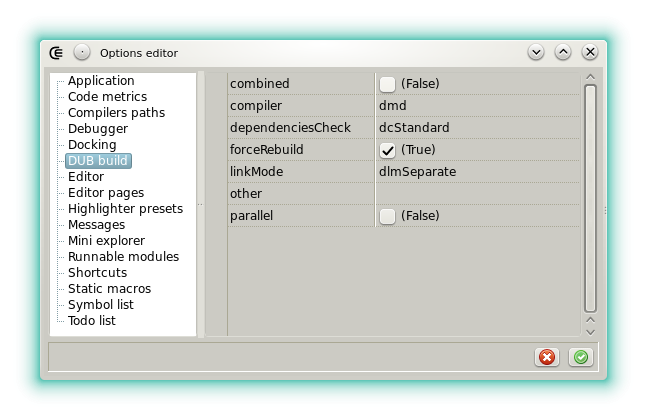





#### DUB build

This category exposes the DUB options that are passed to the build tool each time it's called.

- **archOverride: The option allows to build for x86 under x86_64 and the opposite.
- **autoFetch**: If checked then Dexed will try to download missing dependencies when a project or a libman entry is opened. This option is designed to provide better completion but can slow down the startup and the loading of a project.
- **autoSelectTestConfig**: When not checked the configuration used to test with DUB must be selected before executing the action _Test project_.
- **combined**: If checked, tries to build the whole project in a single compiler run.
- **compiler**: Selects [which compiler](options_compilers_paths) is used by DUB when a project is compiled. Note that the DUB scripts don't use this setting, instead the same preference set for the [runnable modules](features_runnables#options) is used.
- **dependenciesCheck**: Defines how DUB checks the project dependencies, typically used to avoid too much network operations.
- **forceRebuild**: Forces a full recompilation, even if DUB determines that this would not be necessary.
- **linkMode**: Specifies the way the compiler and linker are invoked.
- **other**: Displays a list that can be filled with more switches. One item per line.
- **parallel**: If checked, tries to build using several CPU.
- **showConsole**: If checked, the [consoleProgram set in the global options](options_application) is shown and used to execute DUB.
- **verbosity**: Allows to change the verbosity of DUB. This is interesting when you suspect a bug in the build tool and don't want to leave the IDE to verify.

See also [the official DUB command line reference](http://code.dlang.org/docs/commandline) for more detailed descriptions.




