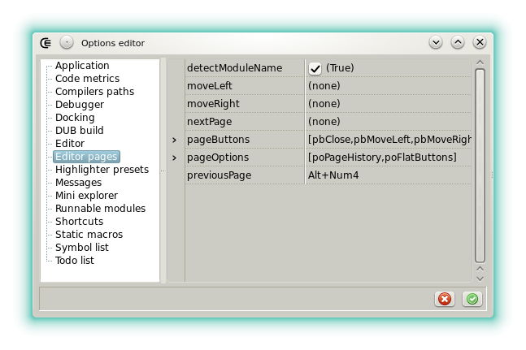





#### Editor pages

This category exposes the options of the page control that hosts the code editors.

- **detectModuleName**: Defines what will be displayed in the tabs. If set modules are lexed in order to find their [module declaration](https://dlang.org/spec/module.html#ModuleDeclaration). Can be deactivated on slowest machines.
- **moveLeft**: Sets the shortcut used to move a page to left.
- **moveRight**: Sets the shortcut used to move a page to right.
- **nextPage**: Sets the shortcut used to select the next page.
- **pageButtons**: Defines which buttons are visible in the toolbar.
- **pagesOptions**: Miscellaneous options.
    - **poPageHistory**: Means the creation order is saved and used to select a particular page when another is closed.
    - **poFlatButtons**: Sets the tool bar buttons look. Normally controlled by the [application option **flatLook**](options_application).
    - **poBottomHeader**: Sets if the toolbar is displayed at the bottom.
- **previousPage**: Sets the shortcut used to select the previous page.




