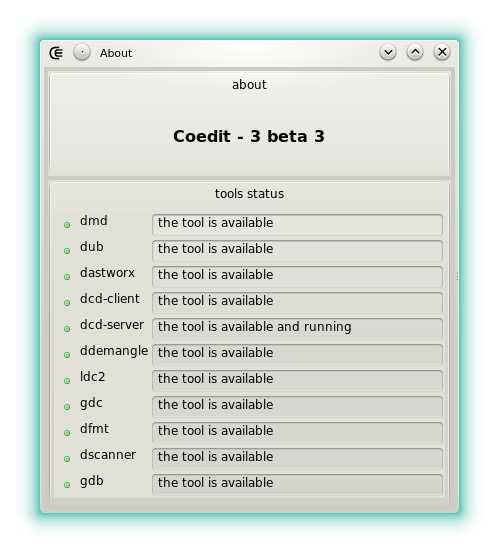







The _about box_ displays the software version and the information about the tools used in background.

The status of each tool is indicated:

- : The tool is well detected.
- : The tool cannot be found but it's not necessary. Expect some features not to work properly even if the software is still usable.
- : The tool cannot be found but it's necessary. The software is not usable. This happens when the tool cannot be located using the PATH variable.




