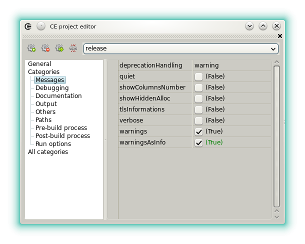






### CE project editor

The widget is used to edit the properties of a project that has the DEXED format (*.dprj extension)
It's no recommended to use this format anymore.

The format is modeled based on the DMD command line interface but it can be compiled with LDC or GDC too,
using the bridges that convert DMD options to LDC (LDMD) or to GDC (GDMD), which is done automatically when they are [set to compile CE the projects](options_application).

#### Toolbar

- : Adds a new compiler configuration. An input-query dialog allows to directly set its name.
- : Removes the current compiler configuration.
- : Clones the current compiler configuration.
-  / : De/activates the synchro-mode. When activated, each particular option edited will be copied to the other configurations.

Notes:

- changing the configuration name is only possible in the section _All Categories_, field _name_.

#### General options

The general options are common to each configuration.

- **AutoSolveDependencies**: When checked, import analysis is performed on the project sources and the static libraries that are used are automatically detected.
- **ConfigurationIndex**: Selects a configuration by its index. This property exists only for the project persistence. To select a configuration, rather uses the project inspector or the combo-box at the top of the widget.
- **LibraryAliases**: Not useful when _AutoSolveDependencies_ is checked. Shows a small editor used to specify the aliases of the libraries used by the project. 
One item per line. An item text must match to an entry of the [libman](widgets_library_manager). It avoids the addition of the **-I** options and the additional sources.
When dependencies are complex, it's possible to select all the entries by setting the first line of the editor to a single asterisk `*`. Note that unless the project _binaryKind_ is set to _executable_ or _sharedlib_ the static libraries selected from this list are not linked.
- **RootFolder**: The project file is not necessarily indicating the root of the project folder. This field can be used to specify another one, either relative or absolute. This is useful to run a custom tool using the **CPR** [symbolic string](features_symbolic_strings) (e.g: git, recursive cleaning).
- **Sources**: Shows a dialog used to edit the filenames of the project sources. Relative paths are automatically handled. Only one item must stand by line.
It's recommended to use the [project inspector](widgets_project_inspector) instead of this archaic editor. To include a folder of source it's also possible to specify a path with a asterisk in the **Paths** options, **ExtraSources** editor.
This avoids to manually remove the obsolete source or to manually add the new source files.
- **version**: Defines a string used to expand the [_CPV_ symbolic string](features_symbolic_strings).
- **versionFile**: Defines the name of a file that contains the **version** text. This property has for effect to replace the existing **version**. The filename can be relative to the project root or absolute.

#### Message options

Groups the options related to the messages emitted by the compiler.
These options are defined per-configuration.

- **deprecationHandling**: Sets the way deprecations are handled (among _silent_ or _error_, **-ds** or **-de**, the default value, _warning_, does not produce a switch).
- **quiet**: Sets if non essential compiler messages are skipped. (**-quiet**)
- **showColumnsNumber**: sets if the horizontal position is shown in the messages. (**-vcolumns**)
- **showHiddenAlloc**: If checked then displays potentially hidden GC allocations. (**-vgc**)
- **tlsInformations**: Sets if thread local storage (TLS) information are displayed. (**-vtls**)
- **verbose**: Sets if verbose. (**-v**)
- **warnings**: Sets if the warnings are displayed. (**-w**)
- **warningsAsInfo**: Defines if the warnings don't prevent the project to be compiled.

#### Debugging options

Groups the options related to the debugging information added to the output binary.
These options are defined per-configuration.

- **codeviewCformat**: Generates debug info using the _codeview_ format. (**-gc**)
- **codeviewDexts**: Adds D _codeview_ extensions. (**-g**)
- **debug**: Sets if debug information are generated. (**-debug**)
- **debugLevel**: Sets the debugging level. (**-debug=x**)
- **debugIdentifiers**: List of debug identifiers. (for each item **-debug=item** is generated). One item per line.
- **generateMapFile**: sets if a map file is generated. (**-map**)

#### Documentation options

Groups the options related to the generation of the project documentation.
These options are defined per-configuration.

- **documentationDirectory**: Sets the directory where the documentation is generated. It can be a relative path. (**-Dd**)
- **generateDocumentation**: Sets if the documentation is generated. This field is constrained to _true_ if the doc path is defined. (**-D**)
- **generateJSON**: Sets if the JSON documentation is generated. This field is constrained to _true_ if the JSON file name is defined. (**-X**)
- **JSONFilename**: Sets the JSON file name. (**-Xf**)

#### Output options

Groups the options related to the code generation.
These options are defined per-configuration.

- **addMain**: Adds an empty _main()_ procedure. (**-main**)
- **alwaysLinkStaticLibs**: Under Windows this option forces to link a static library selected in the _LibraryAliases_ even if not required (for example if the project is itself a static library).
- **binaryKind**: Sets the compiler output kind among: **"staticlib"**, **"sharedlib"**, **"executable"** and **"object"**. (it matches respectively to **-lib**, **-shared**, nothing, **-c**).
- **boundsCheck**: Sets the bounds checking mode, among **"alwaysON"**, **"alwaysOFF"** and **"safeOnly"**. (**-boundscheck=on** or **-boundscheck=off** or **-boundscheck=safeonly**). The switch is not generated when it's a default value.
- **generateStackFrame**: Forces the generation of stack frames. (**-gs**)
- **inlining**: Try to inline functions and procedures. (**-inline**)
- **Optimizations**: Optimize. (**-O**)
- **release**: Do not generate the assertions and the contracts. (**-release**)
- **targetKind**: sets the target registry size, among **auto**(same as current OS) **os32** (targets a 32 bit OS) and **os64** (targets a 64 bit OS). It should usually remain to **auto** however this can be used to verify the portability of the project. (**-m32**, **-m64**)
- **unittest**: generates the unittest code. (**-unittest**)
- **versionIdentifiers**: list of version identifiers. One per line, the switches **-version=** are added automatically. An entry can be disabled by prefixing it with a semicolon or a pair of backslash.

#### Other Options

- **coverage**: Adds the code to generate coverage file after the output gets executed.
- **customOptions**: Allows to add custom options, whatever is the compiler used.
- **dmdOtherOptions**: Custom options, only for DMD.
- **gdcOtherOptions**: Custom options, only for GDC.
- **ldcOtherOptions**: Custom options, only for LDC.
- **guiApplication**: Under windows, use this option to hide the console if the target is a GUI application. Under Linux this option has no effect.

Syntax for the custom / other options:

- the switches must be included. (e.g: an additional version identifier must include the whole prefix _-version=_)
- an entry must not be double quoted, even if it contains a file name with spaces. (they are automatically added later)
- one item per line.
- no leading or trailing spaces.
- an entry can be disabled if it's prefixed by a semicolon or a by pair of backslash.

These custom switches are defined per-configuration.

#### Path options

Groups the options defining the location of the files used or produced by the compiler.
These options are defined per-configuration.

- **exclusions**: Paths or files to exclude from the main sources. The items can contain [symbolic strings](features_symbolic_strings). The items can be global [match expressions](https://en.wikipedia.org/wiki/Glob_(programming)).
- **extraSources**: Either _.lib_, _.a_, _.o_ and _.obj_ files or _.d_, _.di_ source files. If a path that ends with an asterisk is added (e.g: _folderA\folderB\*_) then every source files located in this folder and its sub-folders will be passed to the compiler.
- **forceExtension**: When checked, the output filename has always the right file extension. This option is useful when the _outputFilename_ contains periods but no extension (example: `-offoo.bar` under linux generates the executable `foo.bar` but under windows and if the option is set `foo.bar.exe`).
- **importModulePaths**: A list of paths where _DMD_ has to look for the libraries sources. (**-I**)
- **importStringPaths**: A list of paths used to solve the `import(file)` expressions. (**-J**)
- **objectDirectory**: The directory where object files (_*.o_ or _*.obj_) must be written. (**-od**)
- **outputFilename**: The output filename. The identifier should only include a period to specify a non default extension otherwise it prevents _DMD_ to add the default one. (**-of**)

#### Pre/Post build process options

They define the options of two processes and a bunch of commands, respectively executed before and after the compilation.
These options are defined per-configuration.
These options are not compatible with the system of _base_ & _overridden_ configuration.

- **executable**: The executable file name. If the system cannot solve its path using the environment variables then it must be included.
It can also be represented by a [symbolic string](features_symbolic_strings).
- **options**: A set of options. Activate **poUsesPipe** and **poStdErrToOutput** if you wish to redirect the process output to the messages widget.
- **parameters**: A list of switches and arguments. As usual, one item per line, no double quotes.
- **showWindow**: Sets how the program window is displayed.
- **simpleCommands**: Additionally to the process, a list of shell commands can be specified, they are executed before the pre/post process. The commands have fixed options: always piped to the message widget, the working directory is always the project path.
The commands can contain [symbolic strings](features_symbolic_strings).

The pre-build process is always executed, even if the project has no source files.
This can be used as a trick to compile from another tool.

An interesting post-build process feature is that it can be set on the executable that's just been build.
This is possible when the post compilation process _executable_ is set to the [symbolic strings](features_symbolic_strings) **`<CPO>`**, which is expanded to the name of the file produced by the compiler.

#### Run options

They define the options applied when running the project output (e.g: menu **"project"**, **"compile and run"**). 
The _executable_ field is not present because it relies on the project parameters (**-of** for a CE project and the combination of _targetPath_ with _targetName_ for a DUB project).

If the output is piped then the [process input widget][lnk_widg_procinp] can be used to pass the input to the program being executed.
These options are defined per-configuration.
These options are not compatible with the system of _base_ & _overridden_ configuration.

#### All categories

Unfiltered options, sub categories can be expanded or collapsed. 

- **name**: The current configurations name.
- **isBaseConfiguration**: When checked, the current configuration defines the default options of a configuration which is set as overridden.
- **isOverriddenConfiguration**: When checked, the options of the current configuration are only handled if they don't match to the base configuration or if the base configuration is not set. This system avoids to edit using the synchro-mode.




