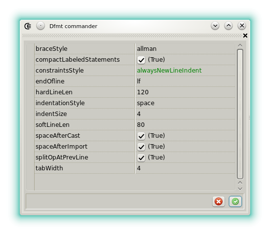







### DFMT commander

The _Dfmt commander_ widget is a simple but complete interface for the D source code formater [Dfmt](https://github.com/dlang-community/dfmt). 
The background tool has to be build and installed in one of the _PATH_ known by the operating system.

A property inspector allows to tweak the format. 
See the [official documentation](https://github.com/dlang-community/dfmt#configuration) to learn more about the options.

- : apply the formatting. The editor state is backed up before each formatting.
- : restore the previous backup.

The formatting is applied in memory and can be undone either from the widget or from the code editor. 
The changes are not physically applied until the file is explicitly saved.




