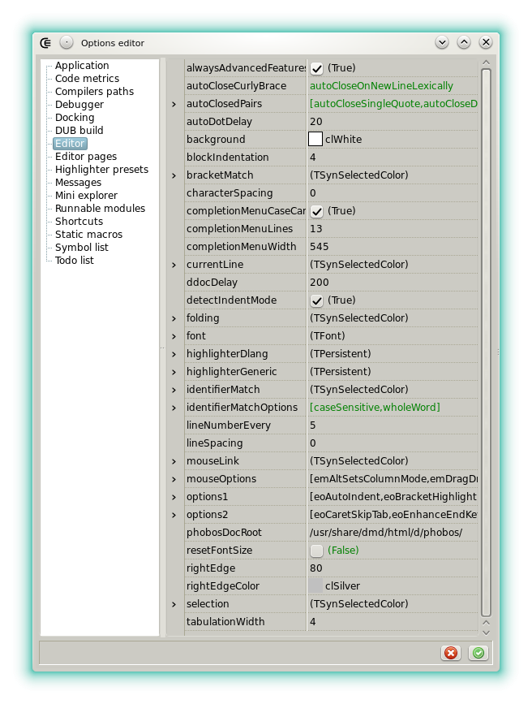


<script src="//cdnjs.cloudflare.com/ajax/libs/anchor-js/4.0.0/anchor.min.js"></script>




### Editor

The _editor widget_ is a standard code editor, specialized for highlighting D source files.


#### Navigation

In addition to the standard actions used to navigate in a source, Dexed implements several helpers:

- **Next/Previous location**: The two actions are used to jump to the locations where the caret was activated. They follow the chronology and not the line numbers. In the [shortcut editor](options_shortcuts_editor) they can be found under the names _PreviousLocation_ and _NextLocation_. The actions are also hard linked to the mouse buttons X1 and X2 and the multimedia keys usually used by web browsers to reload the next or the previous page.
- **Next/Previous changed area**: The two actions are used to jump to the locations that contain changes. They follow the line numbers. In the [shortcut editor](options_shortcuts_editor) they can be found under the names _PreviousChangedArea_ and _NextChangedArea_.
- **Next/Previous protection attribute**: This especially made to navigate in the aggregates. In the [shortcut editor](options_shortcuts_editor) they can be found under the names _PrevProtGroup_ and _NextProtGroup_.

#### Edition helpers

- **Upper / Lower case**: The two actions change the case of the selection.
- **Sort lines**: Shows a dialog with the options allowing to sort the selection.
- **Comment selected lines**: Comments or uncomments the current line or the selection.
- **Comment identifier**: Comments or uncomments the identifier located at the caret.
- **Invert version all none**: Changes the `version(none)` to `version(all)` and conversely.
- **Synchro-edit**: When there's a selection, click the pen icon in the gutter. This allows to rename all the identifier that are lexically equals. To rename using the semantic, see [DCD](features_dcd).


All these actions are assignable to a shortcut via the [shortcut editor](options_shortcuts_editor)

#### Automatic features

Options exist to automatically close the curly brackets (`{ }`), the square brackets (`[ ]`), the parenthesis (`( )`) the double quotes (`" "`), the back-ticks and the single quotes.

The way the right curly bracket is inserted can be tweaked. For the other symbols the feature is always either individually on or off.

Options for the curly brackets:

- _autoCloseNever_: Deactivates the feature. 
- _autoCloseAtEof_: Closes a brace after a `{` located at the end of file.
- _autoCloseAlways_: Closes a brace after a `{`.
- _autoCloseLexically_: Closes a brace after a `{` if the count of braces pairs is odd.
- _autoCloseOnNewLineEof_: Closes a brace after a `{` located at the end of file but only after <kbd>ENTER</kbd>.
- _autoCloseOnNewLineAlways_: Closes a brace after a `{` but only after <kbd>ENTER</kbd>.
- _autoCloseOnNewLineLexically_: Closes a brace on <kbd>ENTER</kbd> and if the count of braces pairs is odd.

The last option is the default. Use the <kbd>CTRL</kbd> key to skip the auto closing done with <kbd>ENTER</kbd>.

#### Custom regions

The custom regions are defined in single line comments.
A region starts with a comment that ends with at least three hyphens and a plus symbol.
A region stops with a comment ending with at least four hyphens.

Two valid examples:

```d
// ctor/dtor -------------+
this(string s){}
this(uint u){}
~this(){}
// ------------------------

// operator overloads ---+
void opIndexAssign(size_t i; T t){}
T opIndex(size_t i){}
// ----
```

Regions are saved and reloaded with the editor cache. They give a clear and compact view of a module.

#### Split view

The split view allows to pin one of the document to the right of all the other documents.

To pin a document, open it in an editor and click the right-most toolbar button.
To unpin a document, select its initial page and click the same button.
The document to pin can be replaced on the fly, still using the same button, and even if the split view is already active.

It's useful to display a module that contains the declarations of a library binding since it's not anymore necessary to change the editor page to verify the members of an enum or the parameters of a function.

#### External Modification tracking

When a document that's edited in Dexed is modified by another program, a _diff_ is displayed.


The dialog is guaranteed to be only displayed when the content contains changes. A simple date of modification has no effect.

#### Linting

If activated in the options (see beyond), the source can be automatically linted, after a relative period of time, following the last keystroke.
Results are displayed in the gutter and the warning body can be consulted in the hint displayed when the mouse motin stops over the icon.
Linting requires [D-Scanner](https://github.com/dlang-community/D-Scanner) to be setup.
It's possible to use the [information box](widgets_about) to determine if Dexed can find the tool.
Note that linting can also be launched manually from the _File_ or the _Project_ menus.

#### Notable options

The editor is highly configurable. 



The options related to the visual look are mainly located in the _highlighterDlang_ and the _highlighterGeneric_ sub categories. 
The category _Highlighter presets_ can be used to customize more easily the style.

The shortcuts are editable in the [shortcut editor](options_shortcuts_editor), under the category _Code editor._

- **alwaysAdvancedFeatures**: When checked, auto-closing or DCD features also work on documents that don't have the _.d_ or the _.di_ extensions.
- **autoCallCompletion**: Call completion after an alphabetic character, without explicit <kbd>CTRL</kbd>+<kbd>SPACE</kbd>.
- **autoCloseCurlyBraces**: See the _Automatic features_ section.
- **autoClosedPairs**: See the _Automatic features_ section.
- **autoDotDelay**: Sets, in milliseconds, how responsive is the completion menu after a `.`.
- **blockIndentation**: By default 4 for the D style.
- **bracketMatch**: Defines the visual style applied to matching brackets pairs.
- **closeCompletionChars**: Defines the characters that, in addition to closing the completion menu, are inserted after the proposal.
- **closeCompletionCharsWithSapce**: Defines the characters that, in addition of closing the completion menu, are inserted after the proposal and a space.
- **completionMenuAutoClose**: Defines if the completion menu is automatically closed when characters are suppressed.
- **completionMenuCaseCare**: Sets if the completion menu is case sensitive.
- **currentLine**: Defines the visual style applied to the current line.
- **ddocDelay**: Sets, in milliseconds, how responsive is the popup that displays the inline documentation.
- **dscannerDelay**: Sets, in milliseconds, the delay between the last keystroke and a call to the linter (if enabled).
- **dscannerEanbled**: Sets if the linter D-Scanner is enabled.
- **detectIndentMode**: If checked the the indentation style (tabs or spaces) is detected when a document is opened. It's applied automatically when <kbd>TAB</kbd> is used.
- **folding**: Sets the code regions that can be folded in the gutter.
- **lineNumberEvery**: Sets the frequency of the line numbers in the gutter.
- **phobosDocRoot**: Sets the location of the standard library html documentation. This is used when <kbd>F1</kbd> is pressed. The value can be a local folder or an http address.
- **plusDdoc**: Sets if instead of `*`, `+` are used in the comment produced by the command _Insert DDoc Template_.
- **resetFontSize**: When checked and if the font size is modified then the font size is resets in all the documents that are opened. The option can be disabled in order to keep the current zoom ratio.
- **smartDdocNewLine**: Allow the auto insertion of a leading `*` or a `+` while writing documentation comments.


<script>
anchors.add();
</script>

