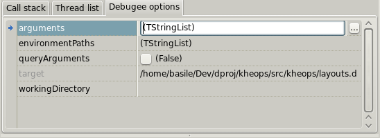







### GDB commander

GDB commander is a GUI front-end for the [GNU debugger](https://www.sourceware.org/gdb/). It's only available under Linux.

It allows to debug the project output (if it's an application) but also the [runnable modules](features_runnables).

#### Breakpoints

The breakpoints are handled by the editor. Click the gutter to add or to remove a breakpoint.
After a break, the following icons may be displayed in the gutter:

- : A breakpoint is reached.
- : A watch point is reached. For now the only watchpoints supported are those that monitor a variable (see the toolbar description).
- : The program execution stopped here for another reason. It may be caused by step by step execution or because an unexpected signal has been received.

#### Target options

This page allows to edit the options passed to the debugger target (also called _the inferior_).

- **arguments**: Allows to set the target command line arguments. One item per line. Items can include [symbolic strings](features_symbolic_strings).
- **environmentPaths**: Allows to add additional folders to the PATH variable. One item per line.
- **queryArguments**: When checked and when the debugging cession starts a small input dialog is displayed. It can be used to pass more **--para --meters** to the target.
- **target**: Read-only. Indicates clearly which is the project or the runnable module that will be debugged.
- **workingDirectory**: Allows to set the target working directory. Can include [symbolic strings](features_symbolic_strings).

#### CPU inspector

This page shows the content of the CPU registers. Each value can be modified.
Note that for now SSE registers are not supported by the inspector.

#### Toolbar

- : Starts debugging. By default the project output is launched. It should be compiled with the debug info generation. A context menu at the right allows to debug the [runnable](features_runnables) binary produced for the editor that has the selection.
- : Stops the debugging cession.
- : Resume the debugging cession.
- : Pauses the debugging cession.
- : Steps to the next instruction, including inside functions. A context menu at the right allows to define if stepping is done at the source level (line by line) or at the hardware level (instruction by instruction).
- : Steps to the next instruction, excluding functions calls. A context menu at the right allows to define if stepping is done at the source level (line by line) or at the hardware level (instruction by instruction).
- : Updates the CPU inspector.
- : Updates the call stack list.
- : Updates the local variables list.
- : Allows to set or remove a watch point. When the button is clicked, a watch is added for the variable that's selected in the variables list. A context menu at the right allows to define the access for which the debugger breaks.
- : Allows to evaluate either the variable or the dereference of the variable selected in the variable list, or a custom expression. To select the mode, use the menu attached to the right of the icon. Note that a specific shortcut allows to repeat the command when the mode is set to "Evaluate Custom Expression", so that the input dialog step is skipped.

#### Custom commands

The field at the bottom allows to pass custom commands to GDB.
A custom command can include a [symbol string](features_symbolic_strings).

You may pass command with the standard CLI syntax (e.g _show_, _set_, etc), however since GDB is launched with the option that activates the machine interface (MI) the standard commands are not guaranteed to work properly.
The option **showRawMiOutput** must be activated in order to get the GDB answer for a custom command in the [messages](widgets_messages).

Learn more about the commands and the MI syntax in [the official manual](http://sourceware.org/gdb/current/onlinedocs/gdb/).

Example of useful commands:

- **-stack-list-variables --skip-unavailable --all-values**: prints a more complete list of variable that the default one. Can be used to set a watchpoint on a variable that's not listed by default.
- **-data-list-register-values xmm0 d**: prints the value of XMM0 as a decimal number. For now the CPU inspector doesn't display the SSE registers so this is the only way to inspect them.

Note that even if in most of the cases the results of a custom command are displayed in the messages a special processing may happen:

- Any commands that may cause an execution break is handled by the interpreter (.so library events, fork events, system calls, function finished, etc).
- Any variation of the `-stack-list-variables` has for effect to update the variable list.

#### Target input stream

The field at the bottom is also used to pass new lines to the target standard input.
To differentiate a custom command from an input line, use the `>` (greater than) symbol.
The text following the symbol is written to the input stream, with an implicit new line character at the end.

#### Options

- **asmSyntax**: Sets the assembler syntax used in the _Assembly_ tab. Intel or AT&T.
- **autoDemangle**: Sets if the GDB output is automatically filtered by [ddemangle](https://github.com/dlang/tools#d-tools). Mostly useful for the _Call stack_ page.
- **autoDisassemble**: Sets if the assembly output is automatically updated when the execution breaks.
- **autoGetCallStack**: Sets if the call stack is automatically updated when the execution breaks.
- **autoGetRegisters**: Sets if the CPU view is automatically updated when the execution breaks.
- **autoGetThreads**: Sets if the thread list is automatically updated when the execution breaks.
- **autoGetVariables**: Sets if the list of the local variables is automatically updated when the execution breaks.
- **commandHistory**: Container that stores the custom GDB commands.
- **coreBreakingSymbols**: List of the symbols specific to the D language, which allow, among other things, to automatically break on `throw`.
- **customEvalHistory**: Container that stores the custom expressions that have been evaluated.
- **ignoredSignals**: Sets the signals that won't break the execution.
- **keepRedirectedStream**: Sets if the files that contain the inferior I/O history are kept on the disk. These files stands in the target directory with the extensions _.inferiorin_ and _.inferiorout_.
- **shortcuts**: Allows to define a shortcut for each button in the toolbar.
- **showGdbOutput**: For debugging the widget. When checked the raw GDB output (before being interpreted) is displayed in [the messages](widgets_messages).
- **showOutput**: Displays the target output in [the messages](widgets_messages). May be deactivated for a GUI program.
- **showRawMiOutput**: For the custom commands or for debugging the widget. When checked the GDB output (after JSON-ization) is displayed in [the messages](widgets_messages).
- **stopAllThreadsOnBreak**: Sets if all the threads of the target are stopped when the execution breaks. Not applied until next debugging cession.




