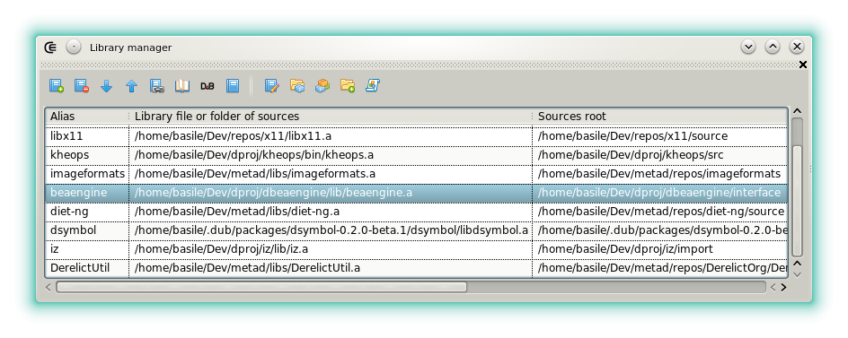
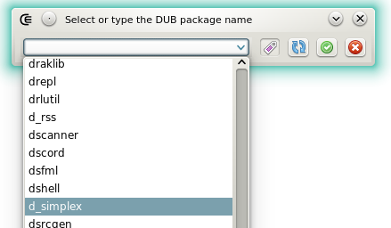

---
title: Widgets - library manager
--- 







### Library manager

#### Description

The library manager (aka the _libman_) is designed to replace the _sc.ini_ or the _sc.conf_ file to manage the static libraries.
Despite of its simplistic look it's a central component of the software. The [completion](features_dcd), the [runnables](features_runnables), the CE project format strongly rely on it.

The _libman_ links the library files (_*.lib_ or _*.a_) to their D sources and are represented with a simple **alias** that is used in different part of the software.
For example, in a CE project, you don't need to specify the **-I** path nor its matching library file name, this is done automatically.

#### Import analysis

Since version 3, the _libman_ also contains a database that links each item to a list of module.
This is used to automatically detect a dependency from a simple import declaration.
This features is only used for the CE project format and the [runnables](features_runnables) modules.

#### Toolbar

- : Adds a library item, by default its fields are initialized with _n/a_.
- : Removes the selected item.
-  **/**  Changes selected entry position.
- : If the current project is a static library then the _libman_ will use its parameters to create an entry. This avoids to browse in the dialogs. Note that sometimes the sources root folder has to be adjusted.
- : If the selected item defines a _project_ then closes current project and opens the one matching to the entry.
- : Allows to fetch the master version of a [DUB registry item](http://code.dlang.org/). See the last section.
- : enable or disable the selected entry. This is mainly useful to test new DMD versions since the libraries often have to be recompiled from a version to another.
- : edit the item alias.
- : select the library file. In some rare case, this field can be omitted (for example if the library file is set in the _sc.ini_).
This can be skipped if the library is only a small orphan _d_ source that's not been compiled as a static library or if the entry is only used for the [DCD](features_dcd) completion.
- : select a folder that contains several libraries files or several orphans modules.
- : select the sources root folder. (the one commonly named 'import').
- : set the project file that matches to the selected item.

#### Register online DUB packages

When the toolbar button that displays DUB logo is clicked, a dialog is displayed. It used to select an online package that will be downloaded, compiled and automatically installed in the _libman_

The text field is used to select the name of the package to install.

- : Update the list of the online packages.
- : By the default the master version of the package is installed. When the tag button is down Dexed rather installs the package from its latest tag.
- : Closes the dialog and start downloading before installing.
- : Cancels and does nothing.




