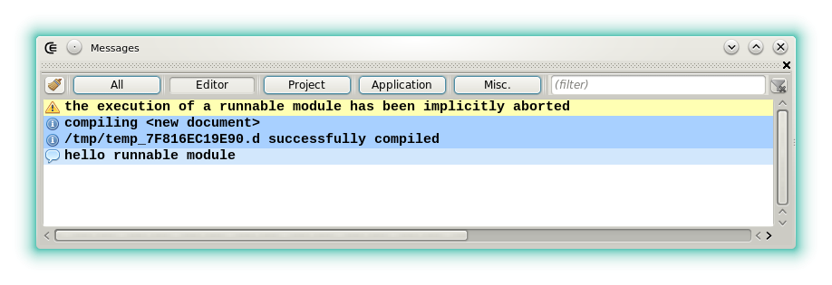
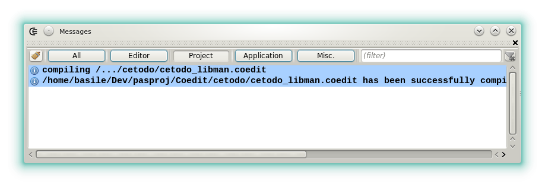
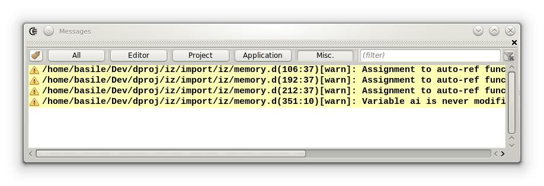
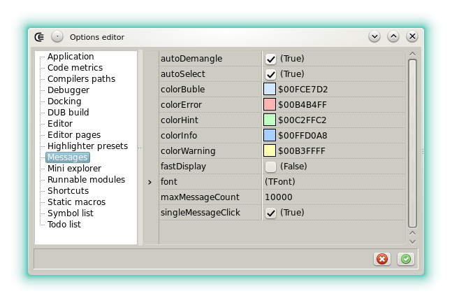





### Messages

#### Description

The widget displays a stream of information about the current file or about the current project.
The messages can be filtered according to their context:

- __All__: no filter.
- __Editor__: filters the messages related to the editor that has the focus (compilation, standard output of the module when executed as a [_runnable_](features_runnables)).
- __Project__: filters the messages related to the current project (DMD or DUB messages, pre/post compilation process output, project execution).
- __Application__: filters the messages emitted by CE (applications warnings, application exceptions).
- __Misc__: miscellaneous messages (messages emitted by the widgets, by the custom tools when their output is redirected, [find all](widgets_search) results, etc). 

When a message is double clicked, it is parsed in order to extract a *position* and a *file name*.
If the operation succeeds then the *file* will be opened at a *position*.
For now *DMD*, [*Dscanner*](https://www.github.com/Hackerpilot/Dscanner) and DUB messages are well parsed.
The messages emitted by the custom tools may also be clickable if they follow a the format: **`<relative|absolute filename>(<line[:column]>)<message body>`**.

The context menu contains a few useful actions, such as *copy messages*, *save message(s) to file*.
By default only the last 500 messages are displayed, regardless of the categories. 
This value and several other options can be changed in the options.

#### Options

- **alwaysFilter**: Sets if the custom filter (text filed at the top right) is maintained or if it's reset when new messages are emitted.
- **autoDemangle**: Automatically filters the new messages with [ddemangle](https://github.com/dlang/tools#d-tools). Note that Dexed uses the tool as a daemon so it's perfectly normal that it remains in the task list when the IDE runs.
- **autoSelect**: Defines if the widget change dynamically the message categories.
This is a recommended setting because if a run-time error happens, it will be immediately displayed.
- **colors**: Allows to associate a message kind to a particular color.
- **fast display**: If set, the new messages are displayed fast but by block. When not set the same amount of message takes longer to be displayed but the operation is smoother.
- **font**: Options for the font used in this widget: the size, the family, etc.
- **maxMessageCount**: Allows to limit the maximum number of messages kept in the list.
- **singleMessageClick**: Allows to open the file that the message parser has found by a single click.




