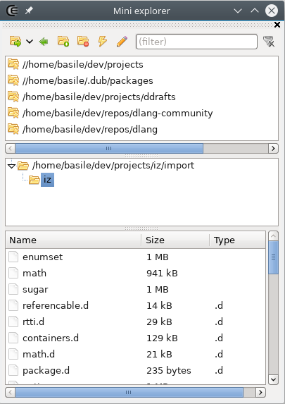
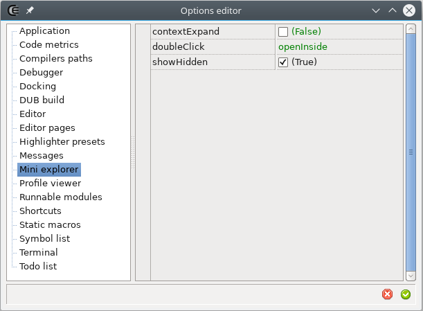






### Mini explorer

#### Description

The mini explorer provides basic file browsing functionality within the IDE.

- : When clicked, allows to select a custom tree root. When using the associated drop down, allows to select a particular drive as root.
- : Got to the root parent folder.
- : Adds the selected folder to the favorites.
- : Removes the selected favorite folder.
- : Open the selected folder or execute the selected file using the shell.
- : If the selected file is a CE or a DUB project then opens it as a project otherwise opens it in a new code editor.
- ***input field***: filter the files whose name contains the text typed.

The file list supports drag and drop.

#### Options

A few options are available in the [option editor](widgets_options_editor).

- **contextExpands**: If checked then the tree auto expands to the folder that contains the source or the project file that's been focused.
- **doubleClick**: Defines what happens when a file is double clicked.
- **showHidden**: Sets if hidden folders and files are displayed.




