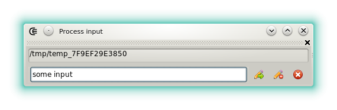







### Process input

The process input widget is used to pass input to the processes that are executed within Coedit.

- : Sends the text to the process, also works with <kbd>ENTER</kbd>.
- : Closes the process input stream.
- : Forces the process termination.

The input text can contain [symbolic strings](features_symbolic_strings).




