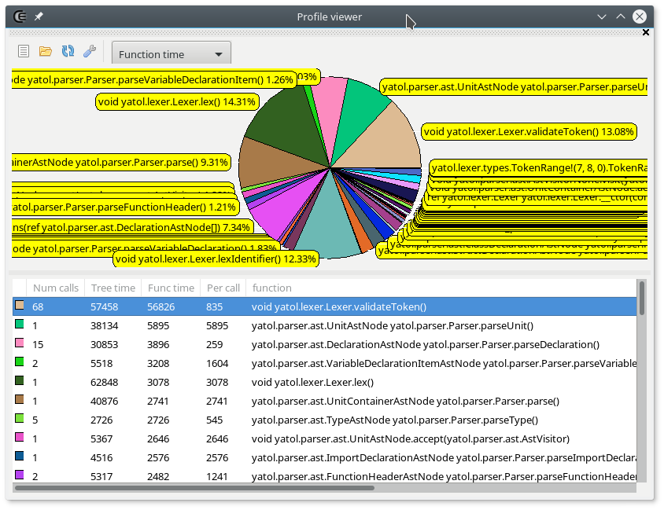







### Profile viewer

#### Description

The _profile viewer_ widget displays the results stored in the _trace.log_ file that a software compiled with DMD outputs when it's compiled with the `-profile` switch.

The pie displays the weight of a each function for a particular criterion.
This criterion can be selected in the combo box that's located in the toolbar.

The list displays all the results, which can be inspected more accurately after sorting a column.

#### Toolbar

- : Loads the _trace.log_ file located in the project output path.
- : Proposes to open the _trace.log_ from a dialog.
- : Reloads the current _trace.log_ or tries to load it from the current directory.
- : Shows the profile viewer options.

#### Options

- **hideAtributes**: Sets if the functions attributes are displayed.
- **hideRuntimeCalls**: When checked, all the functions starting with `core.` are excluded.
- **hideStandardLibraryCalls**: When checked, all the functions starting with `std.` are excluded.
- **otherExclusion**: Allows to define other sub-strings masks.




