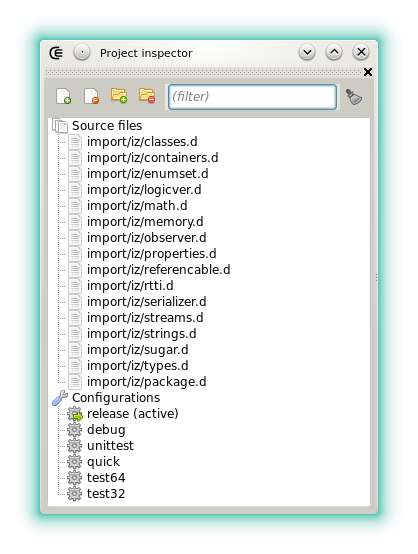







### Project inspector

The project inspector is used to

- select the project configuration.
- open sources in an new editor.
- add or remove source if the active project has the [CE format](features_projects).

The following toolbar buttons are always available:

- : Updates the list of sources files and auto fetch DUB dependencies when applicable.
- : Sets if the sources are displayed in a tree rather than in a single node.

The following toolbar buttons are only visible for CE projects:

- : Adds a D source to the project from a dialog. The new source is not directly opened in the editor. To add a file that is already edited, rather use **"Add file to project"** from the **File** menu.
- : Removes from the project the source that's selected in the tree.
-  Adds a folder of D source to the project from a dialog. The procedure is recursive.
-  Removes from the project the sources files that stand in the same directory as the source selected in the tree.

Note that instead of using the dialogs to add files, it's also possible to drop items from a file explorer.




