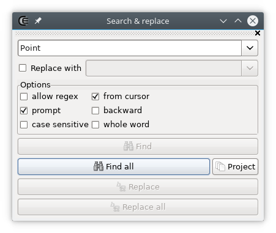
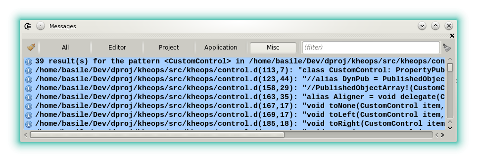

---
title: Widgets - search and replace
--- 





The _find and replace_ widget allows to find and replace text patterns in the focused source editor.

- **first field**: The pattern, the exact string or the substring to find.
- **second field**: The string used as replacement, only active when **"replace with"** is checked.
- **whole word**: Only searches for the whole string.
- **backward**: Searches from the current position to the top.
- **from cursor**: When not checked the operation always starts from the top of the document.
- **case sensitive**: When unchecked the characters case is ignored.
- **prompt**: A confirmation is required to replace a match.
- **allow regex**: When checked, the search is performed by a regex engine. Note that it doesn't mean that the pattern to find has to be a regex).

By default <kbd>CTRL</kbd> + <kbd>F</kbd> is used to pass the current identifier to the first field and <kbd>F3</kbd> to execute a search.
The _Find all_ results are displayed in the [messages widget](widgets_messages), with the context and they can be clicked.

The scope of _Find all_ can be set either to the current editor, to the whole project or to the opened documents by clicking the icon at the right.

Notes:

- To find the declaration of a symbol, <kbd>Ctrl</kbd> + <kbd>MB Left</kbd> or the [symbol list](widgets_symbol_list) are faster.
- To rename a variable or a type, local identifier renaming (<kbd>Ctrl</kbd> + <kbd>F2</kbd>) can be more accurate than _Replace all_ since the action uses the semantic.




