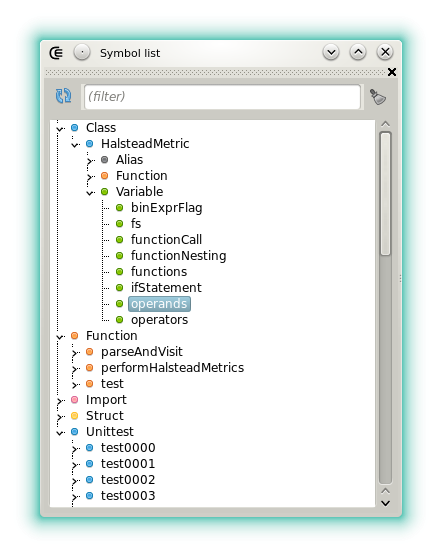
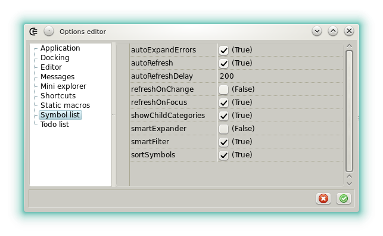





## Symbol list

This list displays the symbols declared in the D module that has the focus (imports, classes, variables, etc).
The widget is a GUI front-end for one the [_dastworx_](https://github.com/Basile-z/dexed/tree/master/dastworx) feature.

It can be used to quickly find and go to the declaration of a symbol but also as a basic linter since the syntactic errors are displayed (almost immediately if the option _refresh on change_ is checked).

The way the widget refreshes the list can be tweaked in the context menu or in the [options editor](widgets_options_editor).

- **autoExpandsErrors**: If checked then the warnings and the errors are always expanded.
- **autoRefresh**: If checked then the symbols are refreshed after _autoRefreshDelay_ milliseconds following the last keystroke.
- **autoRefreshDelay**: Sets the duration before auto refreshing happens.
- **refreshOnChange**: Sets if the list is refreshed when the document is saved.
- **refreshOnFocus**: Sets if the list is refreshed when a document is selected or opened.
- **showChildCategories**: When not checked, only the top level symbols are displayed.
- **smartExpander**: If checked then the the tree follows the caret position.
- **smartFilter**: Change the behavior of the list when the symbols are filtered.
- **sortSymbols**: If checked then the symbols are sorted alphabetically instead of following the declaration order.




