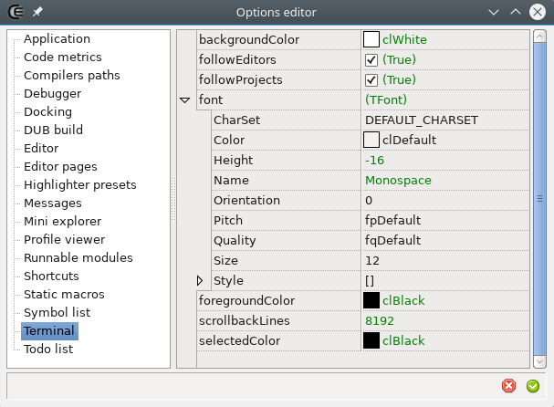







### Todo list

#### Description

The _Terminal_ widget is a terminal emulator integrated in the IDE. It's only available for the linux version.

The terminal requires [libvte](https://github.com/GNOME/vte) to be setup.
This library should be available by default in the package manager of most mainstream distribution, especially those using a GNOME desktop,
since _libvte_ is often used by the system terminal emulator of these distributions.

For now it's mostly usable with hardcoded shortcuts: and the mouse is only used to set the focus or select text (<kbd>SHIFT</kbd>+LeftMB to set the selection start and a second time to set the end).
Commonly used keys are:
- <kbd>HOME</kbd>, <kbd>END</kbd>, <kbd>CTRL</kbd>+<kbd>￩</kbd>, <kbd>CTRL</kbd>+<kbd>￫</kbd>: navigation.
- <kbd>CTRL</kbd>+<kbd>INS</kbd>, <kbd>CTRL</kbd>+<kbd>SHIFT</kbd>+<kbd>INS</kbd>: copy, paste.
- <kbd>￪</kbd>, <kbd>￬</kbd>: commands history.

#### Options

- **backgroundColor**: The background color.
- **followEditors**: When checked the current directory is automatically set to the folder containing a document when it gains the focus.
- **followExplorer**: When checked the current directory is automatically set to the folder that gets selected in the [mini-explorer](widgets_mini_explorer).
- **followProjects**: When checked the current directory is automatically set to the folder containing a project when it gains the focus.
- **font**: Allows to customize the font name and its size. The color is not handled here.
- **foregroundColor**: The font color.
- **scrollbackLines**: The max count of previous lines that are stored.
- **selectedColor**: The bacground when some text is selected. Selected text color is then simply inverted.




