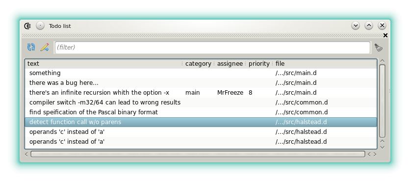
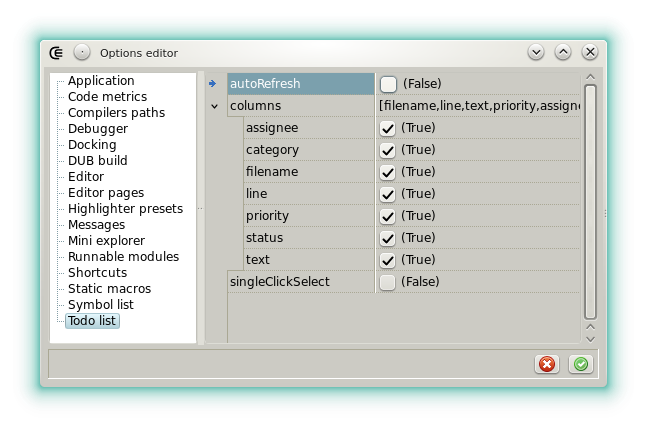


<script src="//cdnjs.cloudflare.com/ajax/libs/anchor-js/4.0.0/anchor.min.js"></script>




### Todo list

#### Description

The _todo list_ widget displays the _todo comments_ located in the source files.



When no source file is opened but a project is, the widget displays the comments of the whole project. 
When a source file has the focus and if it is not part of the project then the widget only displays the items located in this file.
Otherwise if a file has the focus and if it's part of the project then the whole project *todos* are displayed.

It's possible to display the comment that matches to a particular item with a double click.
The items cannot be edited in the widget.

- : Refreshes the list manually.
- : Jump to the item declaration.

#### Format

The _todo comments_ must follow this format:

`TODO|FIXME|NOTE -cCategory -aAssignee -pPriority -sStatus : what`

The fields (-a -c -p -s) are optional but the _what_ is mandatory.

For example

```d
// TODO: something.
// TODO-cfixes: something to fix.
// TODO-cfixes-aMrFreeze: something that MrFreeze has to fix.
// NOTE: a reminder.
```

are valid _todos_.

#### Options



- **autoRefresh**: Automatically refreshes the list when a document or a project is activated and following the rules described upper.
- **columns**: Selects which columns are visible. Despite of the settings a column is only displayed when at least one item uses the matching field.
- **singleClickSelect**: Defines how the mouse is used to go to the item declaration.


<script>
anchors.add();
</script>

